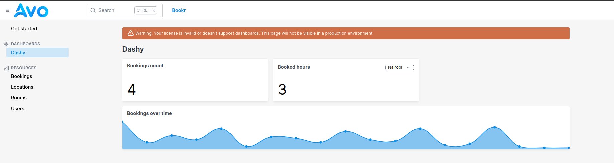
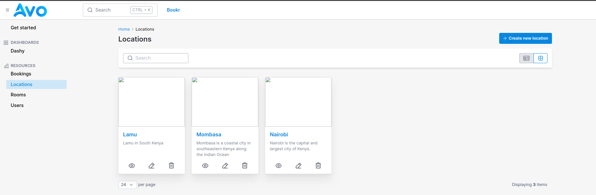

# Avo Admin Dashboard
Simple project that creates a dashboard for this project. It is a simple project that uses the [Avo](https://github.com/avo-hq/avo) Framework.
Avo is a framework that helps you build admin dashboards for your Rails apps. It's a Rails engine that provides a set of tools to help you build a dashboard for your app.

## Project Screenshots

## Getting Started
To get a local copy up and running follow these simple example steps.

## Prerequisites

- You need `Ruby v3.7+`, `Rails v6+` and `Postgresql` installed on your machine.

## Setup
- Clone the project `git clone https://github.com/Benmuiruri/avo-dashy.git`
- navigate to the folder `cd avo-dashy`
- Install required gems `bundle install`

## Usage
- start the server `rails server`
- Visit `http://localhost:3000/avo` and signup with your email and password.
- Enjoy interacting with the app.

## Acknowledgments
Visit the [Avo](https://github.com/avo-hq/avo) Framework for more information. Ever need a dashboard for your Rails app? Avo is the way to go!